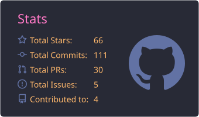
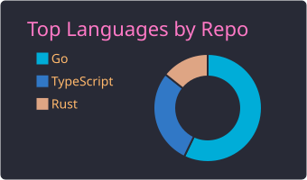
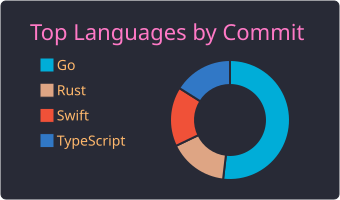
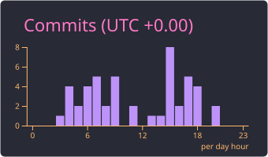

<!-- Claude Code 风格欢迎横幅 -->
<div align="center">

```
╭──────────────────────────────────────────────────────────╮
│                                                          │
│                                                          │
│             ✻ Welcome to shannon's GitHub.               │
│                                                          │
│                                                          │
╰──────────────────────────────────────────────────────────╯
```

</div>

<!-- 打字机动画 -->
<div align="center">
  
</div>

---

### `> /status`

```
⏺ Identity check complete.
  ⎿  shannon (vlyl)
  ⎿  Independent Developer · solo run
  ⎿  Building AI-native tools and agents
  ⎿  Mode: hungry, foolish, shipping
```

---

### `> /tools`

```
⏺ Available tools loaded (25).

  ◆ Languages
    ⎿  Go         ████████░░  proficient
    ⎿  Rust       ████████░░  proficient
    ⎿  Swift      ███████░░░  macOS native
    ⎿  TypeScript █████████░  daily driver
    ⎿  Python     ████████░░  for AI work
    ⎿  Solidity   ██████░░░░  on-chain bits

  ◆ AI & Agents
    ⎿  Claude · GPT · Ollama · Hugging Face
    ⎿  MCP (Model Context Protocol)
    ⎿  LangChain · LlamaIndex · Vercel AI SDK
    ⎿  Vector stores (pgvector · Qdrant · Pinecone)

  ◆ Web & Backend
    ⎿  Next.js · React · Tailwind
    ⎿  Node.js · PostgreSQL · Redis

  ◆ Infra
    ⎿  Docker · Linux · GitHub Actions

  ◆ Daily drivers
    ⎿  Claude Code · Cursor · zsh · tmux · neovim
```

---

### `> /projects`

```
⏺ Featured builds — freshly compacted.

  ● llamask
    ⎿  Fully offline, local-first AI data masking — text, Office, PDF & images
    ⎿  github.com/vlyl/llamask

  ● opssh
    ⎿  OpenSSH hosts × 1Password SSH Agent — private keys never touched
    ⎿  github.com/vlyl/opssh

  ● rightop · delapp
    ⎿  Native macOS utilities — Finder power-ups & a careful app uninstaller
    ⎿  github.com/vlyl/rightop · github.com/vlyl/delapp

  ● repodock
    ⎿  Always-visible GitHub context bar for Chrome, Edge & Firefox
    ⎿  github.com/vlyl/repodock
```

<table align="center">
<tr>
<td valign="top" width="50%">

#### 🦙 [llamask](https://github.com/vlyl/llamask)

`Rust` · Offline AI data masking

<sub>Fully offline, local-first AI data masking. Detects sensitive info in text, Office docs, PDFs & images — with human review and safe-copy export. Your data never leaves the machine.</sub>


</td>
<td valign="top" width="50%">

#### 🔐 [opssh](https://github.com/vlyl/opssh)

`Go` · SSH hosts × 1Password

<sub>Securely manage OpenSSH hosts with the 1Password SSH Agent — without reading, exporting, caching, or logging private keys.</sub>


</td>
</tr>
<tr>
<td valign="top" width="50%">

#### 🗂️ [rightop](https://github.com/vlyl/rightop)

`Swift` · Finder power-ups

<sub>Native macOS Finder extension: smarter path copying, file creation, Terminal shortcuts, checksums, hidden files, and safe permanent deletion.</sub>


</td>
<td valign="top" width="50%">

#### 🗑️ [delapp](https://github.com/vlyl/delapp)

`Swift` · Careful app uninstaller

<sub>A careful, transparent macOS app uninstaller — drop an app, review its related files, and clean leftovers safely. No surprises, no orphans.</sub>


</td>
</tr>
<tr>
<td valign="top" width="50%">

#### 🧭 [repodock](https://github.com/vlyl/repodock)

`TypeScript` · GitHub context bar

<sub>Always-visible GitHub context bar for Chrome, Edge & Firefox: repository, branch, file path & line range, recent-page history, and section quick-nav. Manifest V3.</sub>


</td>
<td valign="top" width="50%">

#### 🦀 [mcpc](https://github.com/vlyl/mcpc)

`Rust` · MCP server scaffolding tool

<sub>A fast scaffolding CLI for spinning up Model Context Protocol servers. Generate boilerplate, wire up handlers, ship in minutes.</sub>


</td>
</tr>
</table>

---

### `> /stats`

```
⏺ Reading session metrics...
```

<!-- 这些 SVG 由 GitHub Action 在你的仓库里生成（见 README 末尾的部署说明） -->
<div align="center">
  
</div>

<div align="center">
  
  
</div>

<div align="center">
  
</div>

---

### `> /history --visual`

```
⏺ Rendering contribution timeline as snake.
```

<div align="center">
  <picture>
    <source media="(prefers-color-scheme: dark)" srcset="https://raw.githubusercontent.com/vlyl/vlyl/output/github-contribution-grid-snake-dark.svg" />
    <source media="(prefers-color-scheme: light)" srcset="https://raw.githubusercontent.com/vlyl/vlyl/output/github-contribution-grid-snake.svg" />
    
  </picture>
</div>

---

### `> /contact`

```
⏺ Reachable via:
  ⎿  github  →  github.com/vlyl
  ⎿  email   →  hi@shannon.page
  ⎿  x       →  x.com/quentangle_
```

---

<!-- 底部状态栏 -->
<div align="center">

```
──────────────────────────────────────────────────────────────────
  ? for shortcuts                  shannon · AI / solo-dev / OCT
──────────────────────────────────────────────────────────────────
```

</div>
